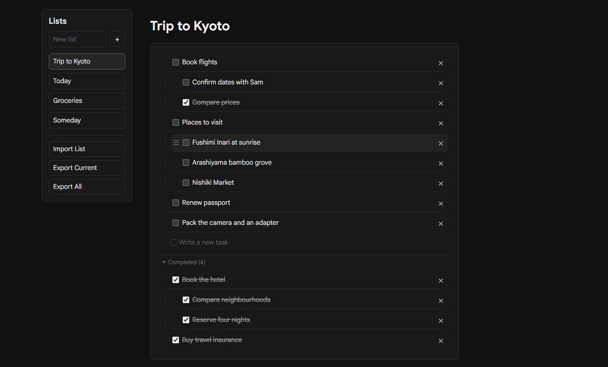

# Simple List

A small desktop to-do app. Lists, tasks, subtasks. Nothing else.

> [!NOTE]
> This app was vibe coded and made for my own use and needs.

## Install

Grab the installer from [Releases](https://github.com/d3lb/SimpleToDoList/releases). It updates itself.

Windows will warn you on first run because the app isn't signed - **More info -> Run anyway**.

## Features

- Multiple lists
- Subtasks, one level deep
- Click any task to edit it, no edit mode
- Drag to reorder, or drop onto a task to nest it
- Import/export as JSON
- All lists saved locally on your PC

## Shortcuts

| Key | Does |
| --- | --- |
| `Enter` | New task below, same level |
| `Tab` | Toggle subtask |
| `↑` / `↓` | Move the task up or down |
| `Backspace` on empty | Delete, caret moves up |
| `Ctrl`+`Z` | Undo |
| `Esc` | Stop editing |
| Double-click a list | Rename |

## Data

`%APPDATA%\simple-list\simple-list-data.json`

## Dev

Built with React, Vite and Electron.
